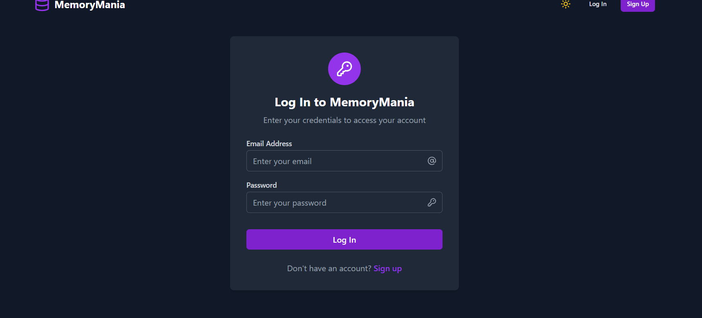
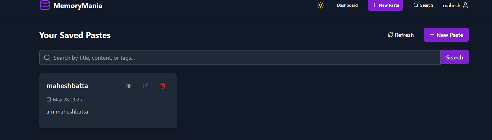

# MemoryMania

A full-stack MERN application for creating and managing text snippets and code pastes.

## Features

- User Authentication (Register/Login)
- Create, Read, Update, Delete (CRUD) operations for pastes
- Syntax highlighting for code snippets
- Responsive design
- Search functionality
- Tag-based organization

## Live Demo

Frontend: https://memorymania-frontend.onrender.com
Backend: https://memorymania-kc51.onrender.com

## Screenshots

### Login Page

### Dashboard

## Technologies Used

- MongoDB
- Express.js
- React.js
- Node.js
- TailwindCSS
- JWT Authentication

## Created By
Mahesh Batta
